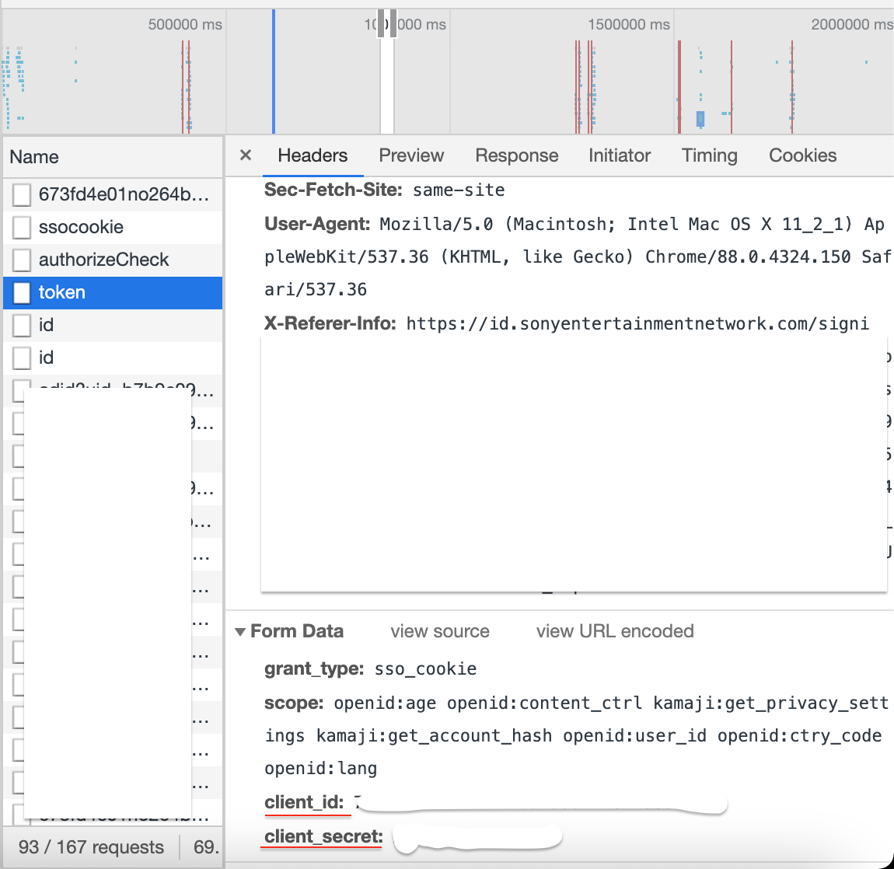

[](https://pkg.go.dev/github.com/sizovilya/go-psn-api)


<p align="center"></p>

# go-psn-api(WIP)
A Playstation Network API wrapper written in Go.
## Read first
Corresponding to my research how PSN works you need several things to interact with Sony servers:  
- npsso - some secret, you need it to obtain access token
- client_id - identifier of client
- client_secret - secret  

To get them please follow steps below.  
### How to get npsso  
Fully described here - https://tusticles.com/psn-php/first_login.html
### How to get client_id and client_secret
- Go to https://account.sonyentertainmentnetwork.com/ and log in with your own credentials
- Open Chrome Dev Tools, go to Network tab and find `token` request, url - https://auth.api.sonyentertainmentnetwork.com/2.0/oauth/token  
  
### Example    
```go
package main

import (
"fmt"
"github.com/sizovilya/go-psn-api"
)

func main() {
  lang := "ru" // full list here https://github.com/sizovilya/go-psn-api/blob/main/langs.go
  region := "ru" // full list here https://github.com/sizovilya/go-psn-api/blob/main/regions.go
  npsso := "your npsso"
  clientId := "your client_id"
  clientSecret := "your secret"
  psnApi, err := psn.NewPsnApi(
    lang,
    region,
    npsso,
    clientId,
    clientSecret,
  )
  if err != nil {
    panic(err)
  }
  // Firstly, you need to authenticate yourself
  // This request will get access_token from Sony's server
  err = psnApi.Auth()
  if err != nil {
    panic(err)
  }
  // How to get user's profile info
  // Response is a Profile struct, see it here https://github.com/sizovilya/go-psn-api/blob/main/profile.go 
  profile, err := psnApi.GetProfileRequest("geeek_52rus")
  if err != nil {
    panic(err)
  }
  fmt.Print(profile)
}
```