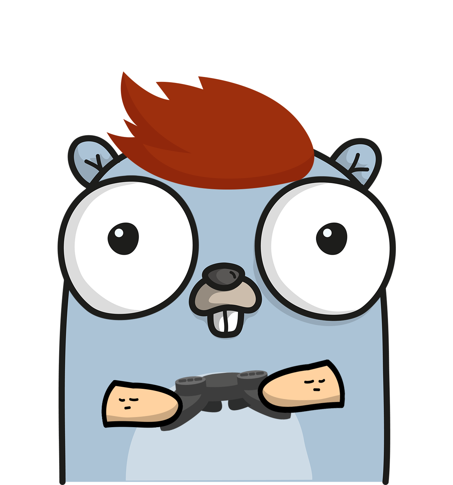

[](https://pkg.go.dev/github.com/sizovilya/go-psn-api)


<p align="center"></p>

# go-psn-api
A Playstation Network API wrapper written in Go.
## Read first
Corresponding to my research how PSN works you need npsso to interact with Sony servers.
Instructions how to get it below.  
### How to get npsso
To interact with the PlayStation Network API, you need a special token called `npsso`. Here's how to get it:

1. **Open your browser's developer console.**
   - In most browsers, you can do this by right-clicking on the page and selecting "Inspect" or by pressing `F12`.
2. **Navigate to the PlayStation Network login page.**
   - Go to: [https://www.playstation.com/en-us/playstation-network/](https://www.playstation.com/en-us/playstation-network/)
3. **Paste the following Javascript code into the console and press Enter:**
   ```javascript
   (function(open) {
       XMLHttpRequest.prototype.open = function(method, url, async, user, pass) {

           this.addEventListener("readystatechange", function() {
               if (this.readyState == XMLHttpRequest.DONE) {
                   let response = JSON.parse(this.responseText);

                   if (response && "npsso" in response) {
                       console.log('found npsso', response.npsso);
                   }
               }
           }, false);

           open.call(this, method, url, async, user, pass);
       };

       window.onbeforeunload = function(){
           return 'Are you sure you want to leave?';
       };

   })(XMLHttpRequest.prototype.open);
   ```
4. **Log in to your PlayStation Network account.**
   - After you successfully log in, you will see a new message in the developer console that looks like this: `found npsso <64 character code>`.
5. **Copy the 64-character code.** This is your `npsso` token.

### Functionality
- You can get user profile info
- You can get trophy titles
- You can get trophy groups
- You can get trophies

### Example    
```go
package main

import (
  "fmt"
  "github.com/sizovilya/go-psn-api"
)

func main() {
  ctx := context.Background()
  lang := "ru" // known list here https://github.com/sizovilya/go-psn-api/blob/main/langs.go, some languages in list are wrong and unsupported now, feel free to investigate for your own and add it to list
  region := "ru" // known list here https://github.com/sizovilya/go-psn-api/blob/main/regions.go, some regions in list are wrong and unsupported now, feel free to investigate for your own and add it to list
  npsso := "<your npsso>"
  psnApi, err := psn.NewPsnApi(
    lang,
    region,
  )
  if err != nil {
    panic(err)
  }

  // This request will get access and refresh tokens from Sony's servers
  err = psnApi.AuthWithNPSSO(ctx, npsso)
  if err != nil {
    panic(err)
  }

  // If you obtain refresh token you may use it for next logins.
  // Next logins should be like this:
  // refreshToken, _ := psnApi.GetRefreshToken() // store refresh token somewhere for future logins by psnApi.AuthWithRefreshToken method
  err = psnApi.AuthWithRefreshToken(ctx, "<your token>") // will get new access token, feel free to manage tokens by yourself
  if err != nil {
    panic(err)
  }

  // How to get user's profile info
  profile, err := psnApi.GetProfileRequest(ctx, "geeek_52rus")
  if err != nil {
    panic(err)
  }
  fmt.Print(profile)

  // How to get trophy titles
  trophyTitles, err := psnApi.GetTrophyTitles(ctx, "geeek_52rus", 50, 0)
  if err != nil {
    panic(err)
  }
  fmt.Print(trophyTitles)

  // How to get trophy group by trophy title
  trophyTitleId := trophyTitles.TrophyTitles[0].NpCommunicationID // get first of them
  trophyGroups, err := psnApi.GetTrophyGroups(ctx, trophyTitleId, "geeek_52rus")
  if err != nil {
    panic(err)
  }
  fmt.Println(trophyGroups)

  // How to get trophies in certain trophy title and trophy group
  trophies, err := psnApi.GetTrophies(
  	ctx,
	"NPWR13348_00", // The Last of Us 2
	"001",         // trophy group with id = 001
	"geeek_52rus",
  )
  if err != nil {
      panic(err)
  }
  fmt.Println(trophies)
}

```
This project highly inspired by https://github.com/Tustin/psn-php. Some useful things like auth headers and params found in `Tustin/psn-php`. 
<p align="center">  </p>
